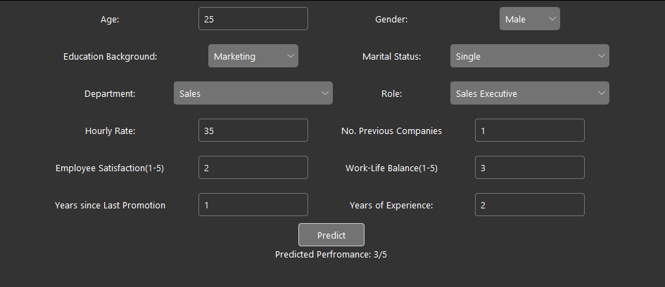
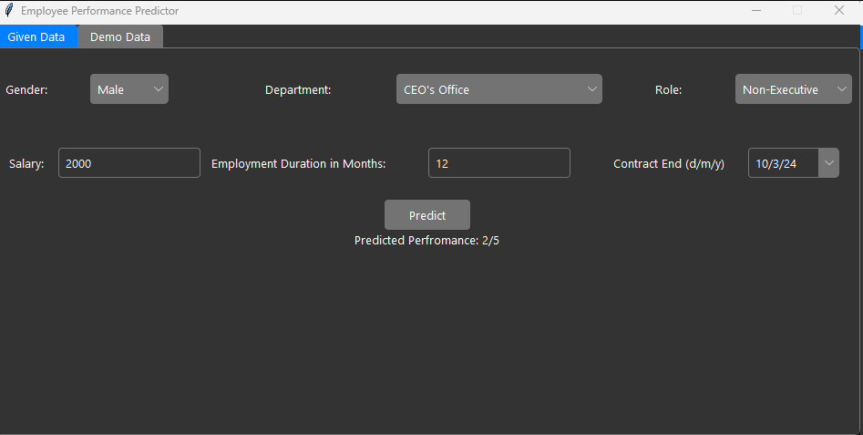

# Employee_Performance_Predictor

## 1 - First Dataset 
“INX_Future_Inc_Employee_Performance_CDS_Project2_Data_V1.8”

The demo dataset originally had 25 columns of data and the performance of 1200 employees. This data was simplified to 12 columns of data to demonstrate the process of creating a model using the data. 

The 12 columns were: 
['Age', 'Gender', 'EducationBackground', 'MaritalStatus',
 'EmpDepartment', 'EmpJobRole', 'EmpHourlyRate', 'NumCompaniesWorked',
 'EmpEnvironmentSatisfaction', 'EmpWorkLifeBalance',
 'YearsSinceLastPromotion', 'TotalWorkExperienceInYears'] + ’PerformanceRating'

The original unmodified dataset was able to achieve 92% accuracy while the simplified data set was able to achieve 73.8% due to the removal of some columns of data. Subjective parameters such as employee environment satisfaction were measured on a scale from 1 to 5. The performance of the employees was also measured using the same scale. 

The model used was a simple neural network of dimension 60x3. The model made predictions using the data and then compared it to the existing performance rating of the employees in the dataset. The difference between the predicted and existing performance was used to teach the model and improve its performance.

A GUI was made in order to use the trained model to predict the performance of future employees using the data entered. Users have to fill the data and then press the predict button to get a performance score rated out of 5.

## 2 - Second Dataset 
“InvestKL Dataset”

The dataset was transformed into an excel sheet where the info is more meaningful to the model. The final dataset includes the following features:
['Gender', 'Role', 'Department', 'Salary (Rm)', 'Length Of Employment (M)', 'Contract End Date']

The performance data was not provided, but for the sake of demonstration a random performance was assigned to each employee. The model was trained with a simple neural network with size 128x3. Due to the limited data available, the model was able to achieve only 66.6%. Similar to the demo dataset, a GUI was developed where the user can input the details and get a predicted Performance score.

